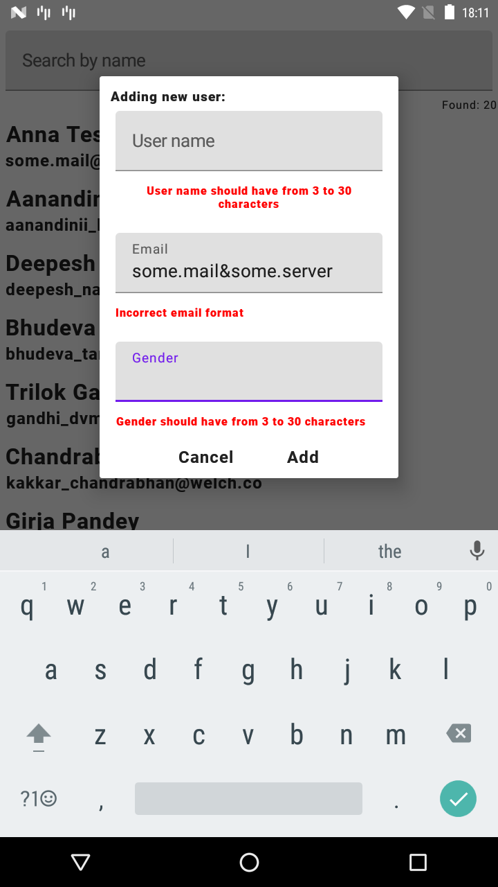
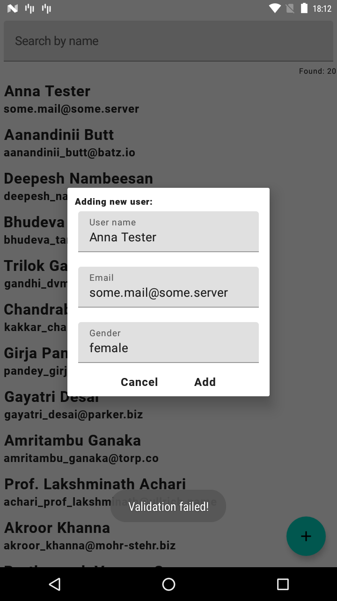
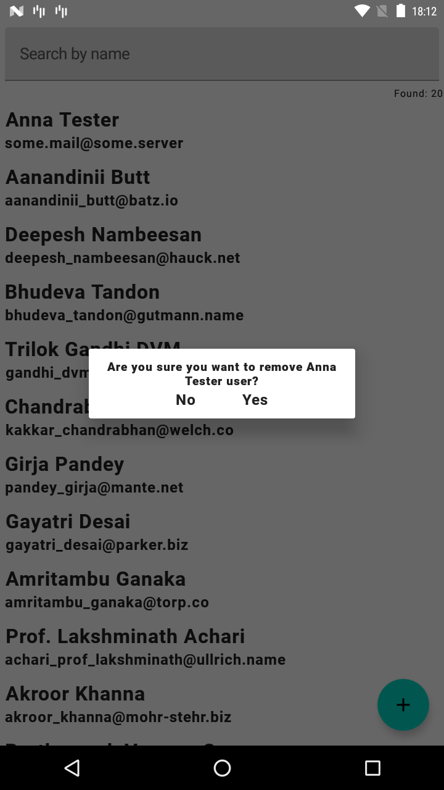
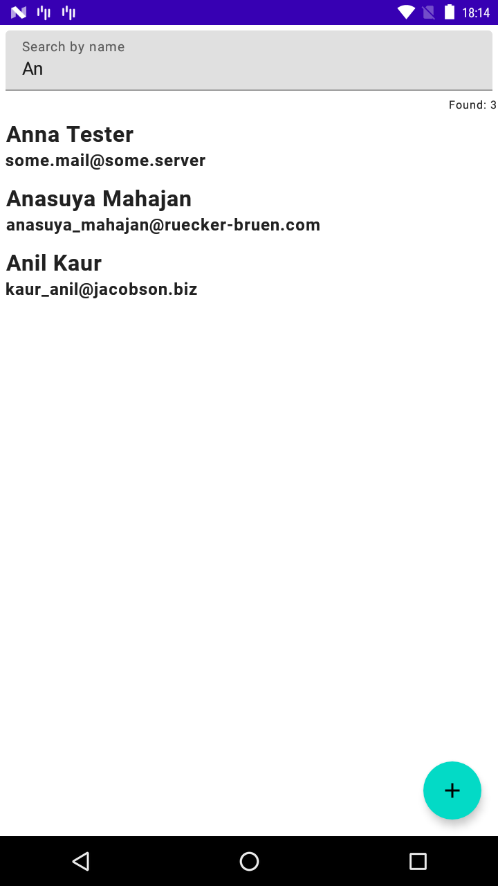
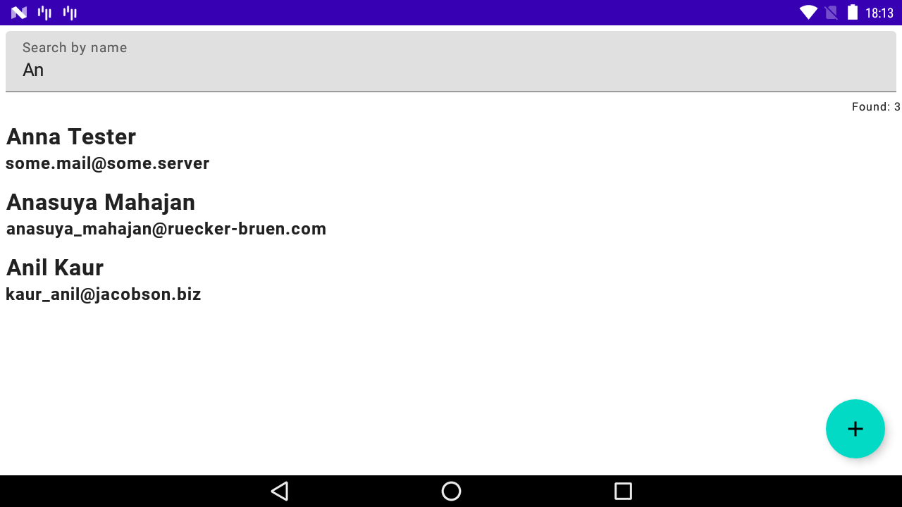

# Managing Users POC
Example application build on https://gorest.co.in/ public API as an architecture test case.

The purpose of this application is to show usage of some basic libraries and architecture concepts:
* Clean architecture
* MVVM
* Composer
* coroutines, flows
* GraphQL
* Lottie

## Screen shots

Further development should be focused on:
* androidTests - Testing fragments and emitting ViewEvents
* Support edge cases of Activity <--> System interaction
* Support for animations and transitions
* Improve dialog place in architecture. 
* Testing business flows. 
* Move snackBars/toasts? to composer.

